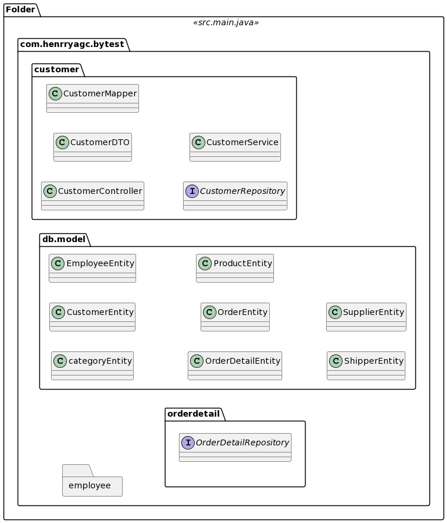
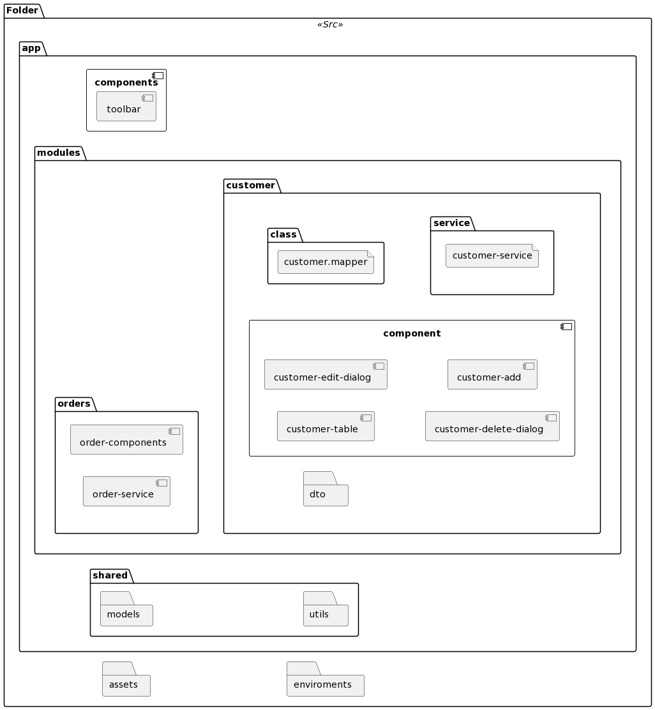

# BYTE Test java programing

Dessarrollo de una aplicación web para el manejo de operaciones CRUD de la tabla Customers.

## 1 Requerimientos

#### Funcionales

1. Utilizar MYSQL como motor de base de datos
2. Todas las tablas deberan tener registros
3. Operaciones "CRUD" de la tabla "Customers" (listado)
4. UI intuitivo y responsivo
5. Validación de las enradas del usuario

#### No Funcionales

1. Paradigma POO (Herencia, Polimorfismo, Encapsulamiento)
2. Lenguaje de Programación JAVA
3. Frameworks (Angular9+ y Spring Boot)
4. Tiempo límite de entrega (una semana)
5. Realizar una presentación

## 2 Backend Java 17 - Spring Boot

### Use in development
    - FLux
    - Servicio
    - Repositorio
    - Controlador
    - Mapeador
    - Programación reactiva
    - Programación funcional
    - Responsabilidad única
    - Model - Entity - Record
    - Inyección de dependencias
    - Arquitectura spring boot
    - POO

## 3 Frontend Angular 14

### Use in development
    - Routing
    - Carga perezosa
    - Componente independiente (standalone)
    - Formularios reactivos
    - Servicios
    - Programación reactiva
    - Programación funcional
    - POO
    - Interfaces/model
    - Responsabilidad única
    - Inyección de dependencias
    - Arquitectura por jerarquía
    - Responsive
    - Intuitivo

## 4 Funcionamiento de la aplicación web

